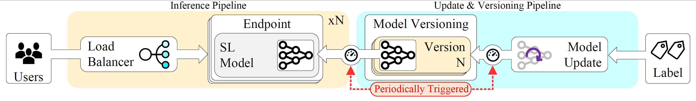

# A MLOps Architecture for Near Real-time Distributed Stream Learning Operation Deployment
## *Authors:* Miguel G. Rodrigues, Altair Santin, Fabrício Enembreck e Eduardo Viegas.
Traditional architectures for implementing Machine Learning Operations (MLOps) usually struggle to cope with the demands of Stream Learning (SL) environments, where deployed models must be incrementally updated at scale and in near real-time to handle a constantly evolving data stream. This paper proposes a new distributed architecture adapted for deploying and updating SL models under the MLOps framework, implemented twofold. First, we structure the core components as microservices deployed on a container orchestration environment, ensuring low computational overhead and high scalability. Second, we propose a periodic model versioning strategy that facilitates seamless updates of SL models without degrading system accuracy. By leveraging the inherent characteristics of SL algorithms, we trigger the model versioning task only when their decision boundaries undergo significant adjustments. This allows our architecture to support scalable inference while handling incremental SL updates, enabling high throughput and model accuracy in production settings. Experiments conducted on a proposal’s prototype implemented as a distributed microservice architecture on Kubernetes attested to our scheme’s feasibility. Our architecture can scale inference throughput as needed, delivering updated SL models in less than 2.5 seconds, supporting up to 8 inference endpoints while maintaining accuracy similar to traditional single-endpoint setups.
## Proposta:

